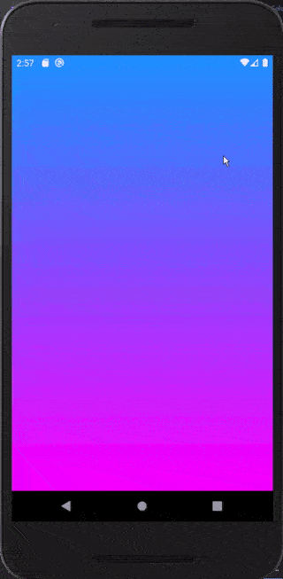

# Civi Take-Home Exercise

    

## Layout

- [`App/Components`](App/Components): presentational components
- [`App/Containers`](App/Containers): container components
- [`App/Config`](App/Config): configuration of the application
- [`App/Sagas`](App/Sagas): redux sagas
- [`App/Assets`](App/Assets): assets (images, videos etc)
- [`App/Services`](App/Services): application services
- [`App/Theme`](App/Theme): styles for the application
- [`App/Navigators`](App/Navigators): react navigation navigators 
- [`App/Stores`](App/Stores): redux actions, reducers and stores

## Dependencies

- [React Native](https://facebook.github.io/react-native/)
- [React Navigation](https://reactnavigation.org/)
- [Redux](https://redux.js.org/)
- [Redux Sagas](https://redux-saga.js.org)
- [Redux Persist](https://github.com/rt2zz/redux-persist)
- [reduxsauce](https://github.com/infinitered/reduxsauce)
- [prettier](https://prettier.io/)
- [axios](https://github.com/axios/axios)

## Installation

1. Clone this repository.
2. Install the dependencies by running `yarn`.
3. Change the IP in `App/Config` to your machine IP.
4. Install the API dependencies by running `cd Api && yarn`.
5. Run `yarn start:api` to start the API.

### Android

  - The first time you run the project, you need to generate a debug key with:
    - `cd android/app`
    - `keytool -genkey -v -keystore debug.keystore -storepass android -alias androiddebugkey -keypass android -keyalg RSA -keysize 2048 -validity 10000`

  - Now you can start the bundler and run the app.
    - `yarn start`
    - `yarn android`

### iOS

- `cd ios`
- You need to install the pod dependencies.
  - `pod install`

- Now you can start the bundler and run the app.
  - `yarn start`
  - `yarn ios`